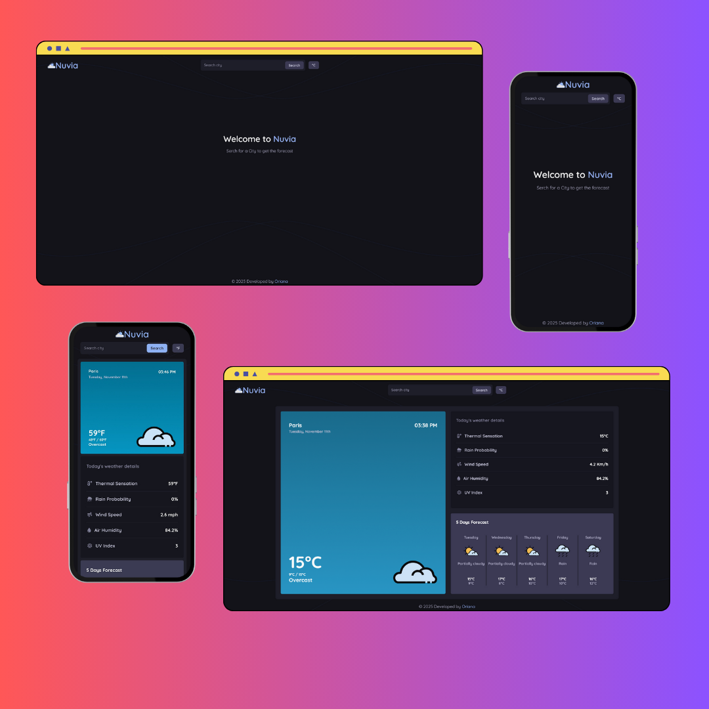

# Nuvia Weather App

## 🔗 [Live Demo](https://weather-app-fle3.onrender.com)

## Project Description

A beautiful, responsive weather forecast application that provides current conditions and 5-day forecasts. Built with modern JavaScript and Express.js backend to practice full-stack development and API integration.

## Key Features

- **Current Weather Display:** Real-time temperature, conditions, and detailed metrics
- **5-Day Forecast:** Extended weather predictions with min/max temperatures
- **Temperature Unit Toggle:** Switch between °C and °F with persistent preferences
- **City Search:** Search for weather information worldwide
- **Responsive Design:** Optimized for desktop and mobile devices
- **Dynamic Backgrounds:** Automatic day/night background themes based on local time
- **Weather Icons:** Visual representation of current conditions
- **Local Storage:** Saves preferred temperature units and last searched city

## Technologies Used

- **Frontend:** JavaScript (ES6 Modules), HTML5, CSS3
- **Backend:** Node.js, Express.js
- **Weather API:** Visual Crossing Weather API
- **Date Handling:** date-fns library for timezone-aware date formatting
- **Icons:** Font Awesome for UI icons, Visual Crossing for weather icons
- **Build Tool:** Webpack for module bundling and asset optimization
- **Storage:** Web Storage API for user preferences

## Project Structure

## Architecture

The application follows a modular architecture with clear separation of concerns:

- **Backend Layer (server.js):**

  - Express.js server with RESTful API endpoints
  - Proxy server to handle CORS and API key security
  - Static file serving for production builds

- **Data Layer (api.js, dataFormater.js):**

  - Handles Visual Crossing Weather API integration
  - Transforms and formats raw API data for frontend consumption
  - Manages error handling and fallback data

- **Business Logic Layer (unitConverter.js, storage.js):**

  - Temperature and unit conversion between °C/°F
  - Wind speed unit conversion (km/h to mph)
  - Local storage management for user preferences
  - Persistent settings across browser sessions

- **Presentation Layer (render.js, styles.css):**
  - Dynamic DOM rendering and updates
  - Smooth animations and transitions
  - Responsive design with CSS Grid and Flexbox
  - Day/night theme switching based on local time

## UI/UX Features

- **Animated Intro:** Smooth welcome screen that transitions to weather content
- **Sticky Footer:** Always visible footer that stays at bottom of viewport
- **Loading States:** Visual feedback during API requests
- **Error Handling:** User-friendly error messages for failed searches
- **Color-Coded Metrics:** Consistent color scheme with CSS custom properties
- **Interactive Elements:** Hover effects and smooth transitions
- **Accessible Forms:** Proper form labels and keyboard navigation

## Development Notes

This project was an excellent opportunity to:

- Practice full-stack JavaScript development with Node.js and Express
- Implement secure API key management through backend proxy
- Work with third-party weather APIs and data transformation
- Create a responsive design that works across all device sizes
- Implement unit conversion systems with persistent user preferences
- Handle timezone-aware date formatting and display
- Build smooth page transitions and loading states
- Practice module separation and clean code architecture
- Implement local storage for user preferences persistence
- Create dynamic CSS theming based on time of day
- Develop error handling and user feedback systems
- Optimize assets and bundle with Webpack for production

## Screenshots & Gifs

### Desktop & Mobile View

## Usage

### Searching for Weather

1. Enter a city name in the search bar
2. Click "Search" or press Enter
3. View current conditions and 5-day forecast

### Changing Temperature Units

1. Click the temperature unit button (°C/°F)
2. All temperatures will automatically convert
3. Preference is saved for future visits

### Understanding the Display

- **Current Weather Card:** Shows main conditions with large temperature display
- **Today's Details:** Expanded metrics with icons and values
- **5-Day Forecast:** Future predictions with min/max temperatures
- **Dynamic Background:** Changes based on local time at searched location

## Installation & Local Development

## Installation

1. Clone the repository:
   git clone https://github.com/OrianaLand/weather-app.git

2. Install dependencies:
   npm install

3. Create a .env file and add your Visual Crossing API key:
   WEATHER_API_KEY=your_api_key_here

4. Start the development server:
   npm run dev

5. Open your browser and navigate to http://localhost:3000

## API Reference

# Backend Endpoints

- GET /api/weather?q={city} - Fetch weather data for specified city

# Frontend Modules

- getWeather(city) - Fetches weather data from backend

- renderTodayForecast(data) - Renders current weather information

- convertTemperature(value, fromUnit, toUnit) - Handles unit conversion

- saveCity(city) - Persists last searched city

# Deployment

This application is deployed on Render.com with:

- Automatic builds from GitHub repository

- Environment variable management for API keys

- Free tier hosting with continuous deployment

## License

This project is open source and available under the ISC License.

## Contact

Oriana - inkedin.com/in/oriana-landaeta - landaetaoriana@gmail.com

Project Link: https://github.com/OrianaLand/weather-app
